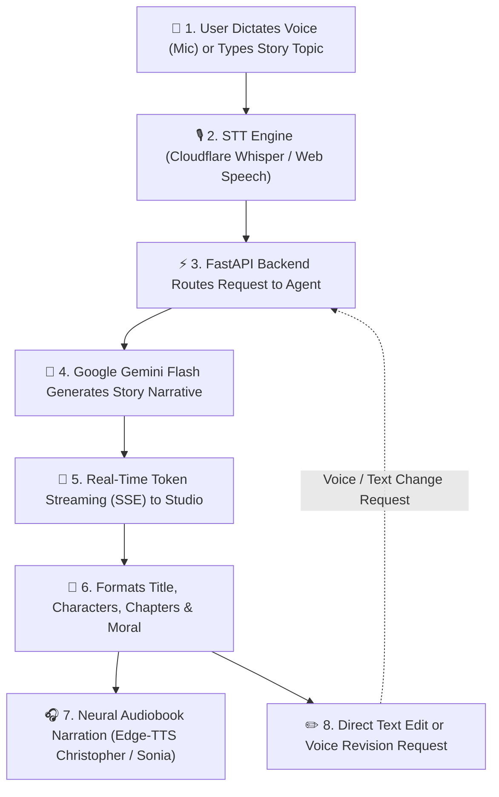
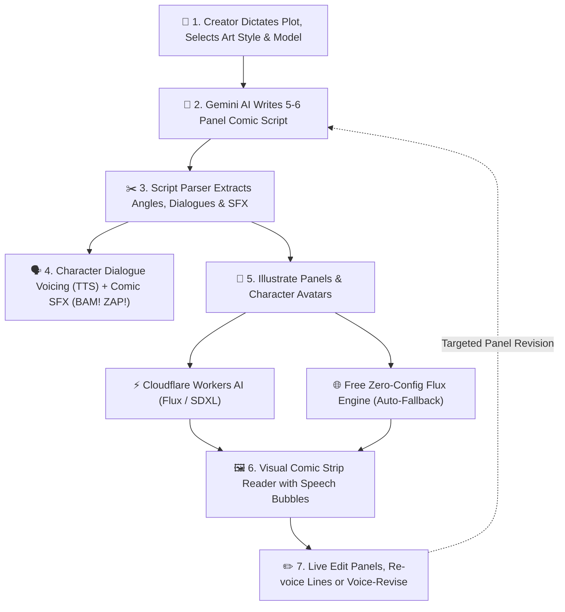
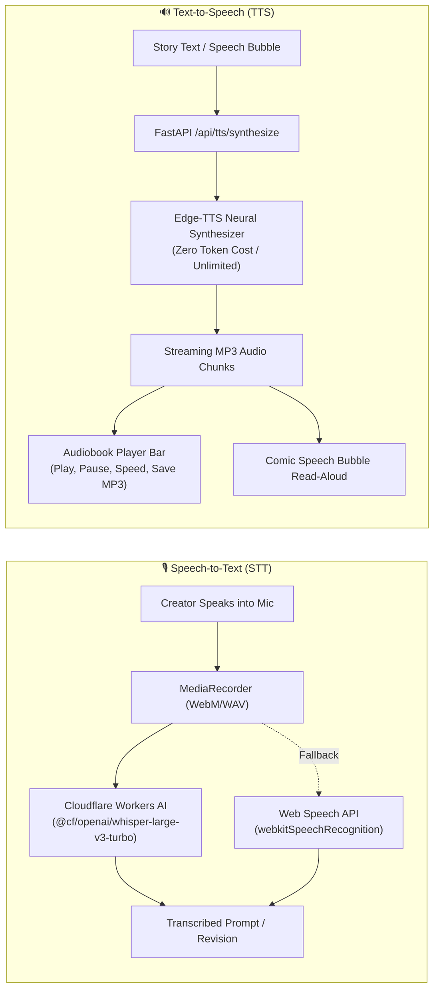
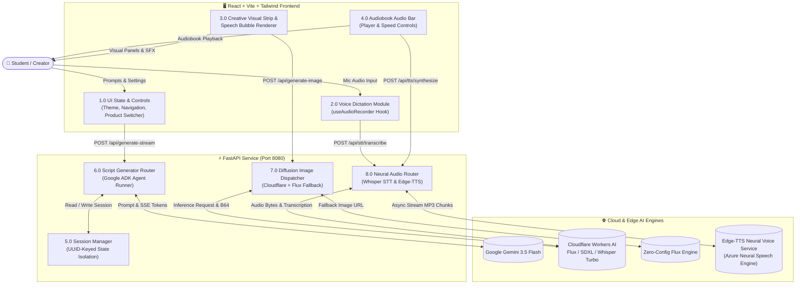

# System Flowcharts & Data Flow Diagrams — AI Creative Studio

Visual workflows, Data Flow Diagrams (DFD), and execution pipelines for the creative studio:

1. [AI Story Generator Flowchart & Audiobooks](#1-ai-story-generator-flowchart)
2. [AI Comic Book Generator Flowchart & Dialogue Voicing](#2-ai-comic-book-generator-flowchart)
3. [Full-Duplex Neural Audio Pipeline (STT & TTS)](#3-neural-audio-pipeline-flowchart-stt--tts)
4. [System Architecture & Data Flow (Level 1 DFD)](#4-system-data-flow-diagram-level-1-dfd)
5. [Key Highlights & Technology Stack](#5-key-highlights--technology-stack)

---

## 1. AI Story Generator Flowchart

### Story Steps Explained
1. **Creative Input (Voice or Text):** Creator dictates their idea via the **Voice Mic 🎙️** or selects a suggestion chip (e.g., *Whispering Clock*).
2. **Speech Transcription:** Cloudflare Workers AI Whisper Large v3 Turbo transcribes speech in real time with live Web Speech preview.
3. **Backend Processing:** FastAPI initializes session isolation and formats instructions for the `story_agent`.
4. **AI Generation:** Google Gemini Flash crafts a complete story structured with title, character profiles, 5–6 narrative chapters, and an uplifting moral.
5. **Live Token Streaming:** Server-Sent Events (SSE) stream the narrative word-by-word into the studio.
6. **Audiobook Player Bar:** Readers can listen to the full story narrated aloud with high-fidelity neural voices (`Christopher`, `Sonia`, `Guy`, `Jenny`), adjust reading speed (0.8x, 1.0x, 1.2x), and download the audiobook as an `.mp3`.
7. **Interactive Editing:** Creators can live-edit text or speak revision directions to the AI Story Doctor.

---

## 2. AI Comic Book Generator Flowchart

### Comic Steps Explained
1. **Creative Prompt:** Creator specifies a comic idea by typing or using the **Voice Mic 🎙️**, chooses an art style (*Modern Marvel/DC, Manga, Pop-Art, Pixar 3D, Noir, Watercolor*), and selects the image model.
2. **Script Generation:** Gemini AI writes a cinematic 5–6 panel script complete with camera setups `[Camera: ...]`, narration captions, character quotes, and sound effect badges (**BAM!**, **WHOOSH!**, **ZAP!**).
3. **Dialogue Voicing & SFX:** Each speech bubble includes a **"Speak"** button powered by `edge-tts` character voices, synchronized with interactive Web Audio synthesizer sound effects.
4. **Visual Illustration:** Clicking *Illustrate Panel* or *Generate Avatars* routes the visual prompt through Cloudflare Workers AI (or the zero-config fallback engine).
5. **Strip Reader & Director Mode:** Renders visual panels with dialogue overlays, whole-panel read-aloud narration, and voice-driven scene revisions.

---

## 3. Neural Audio Pipeline Flowchart (STT & TTS)

---

## 4. System Data Flow Diagram (Level 1 DFD)

---

## 5. Key Highlights & Technology Stack

| Feature | Technology | Role | Free Allowance |
| :--- | :--- | :--- | :--- |
| **AI Scriptwriting** | Google Gemini 3.5 Flash + Google ADK | Structured narrative chapters & comic panel scripts | 1,500 requests/day, 1M TPM |
| **Live Streaming** | Server-Sent Events (SSE) & FastAPI | Sub-second word-by-word streaming generation | Included in backend |
| **Speech-to-Text (STT)** | Cloudflare Workers AI Whisper Large v3 Turbo | Voice-dictated prompts and voice revision instructions | 10,000 Neurons/day free |
| **STT Fallback** | Web Speech API (`SpeechRecognition`) | Instant real-time live preview & zero-config fallback | 100% Free / Client-side |
| **Neural TTS** | `edge-tts` (Microsoft Azure Neural Engine) | Studio audiobook narration & character dialogue voicing | 100% UNLIMITED / Zero API keys |
| **Voice Profiles** | Christopher, Sonia, Guy, Jenny, Eric | Distinct personalities for Narrators, Heroes, and Villains | Unlimited free synthesis |
| **AI Illustrations** | Cloudflare Workers AI (Flux / SDXL) | Zero-cost comic panel & character avatar generation | 10,000 Neurons/day free |
| **Fallback Diffusion** | Zero-Config Free Flux Engine | 100% reliable instant image generation fallback | Zero setup required |
| **Comic SFX** | Web Audio API (Sawtooth & Bandpass Filters) | Synthesized comic sound effects (**BAM!**, **ZAP!**) | 100% Free / Client-side |
| **Frontend UI** | React 19 + Tailwind CSS v4 & Lucide Icons | Responsive studio with dark/light themes & audio bar | High-performance SPA |
