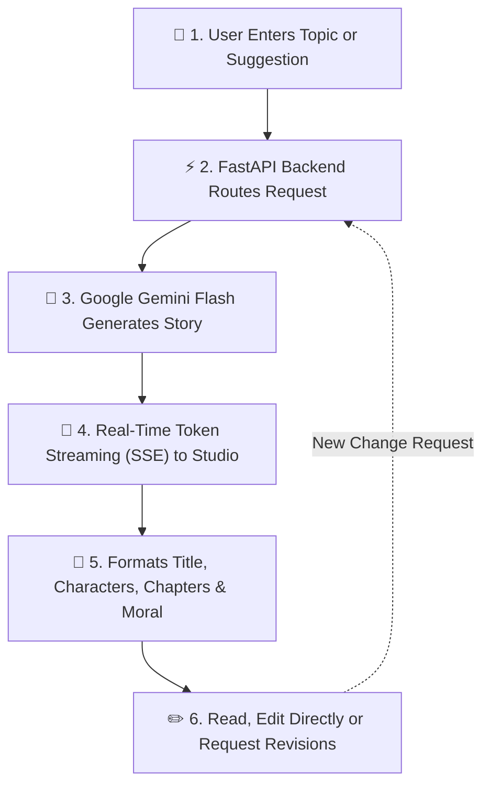
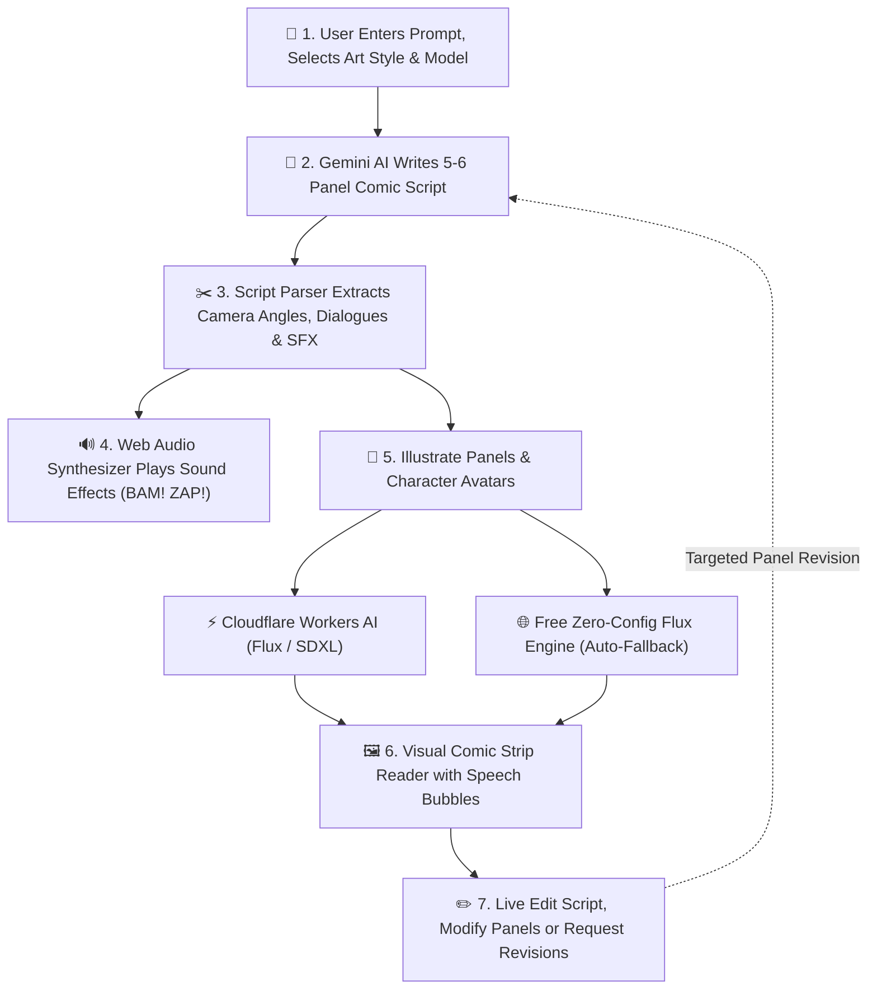

# System Flowcharts — AI Creative Studio

Clean, intuitive, and simple visual flowcharts for each of the creative studio's two core products:

1. [AI Story Generator Flowchart](#1-ai-story-generator-flowchart)
2. [AI Comic Book Generator Flowchart](#2-ai-comic-book-generator-flowchart)
3. [Key Highlights & Technology Stack](#key-highlights--technology-stack)

---

## 1. AI Story Generator Flowchart

### Story Steps Explained
1. **User Input:** Enter any imaginative topic or click a creative suggestion chip (e.g. *Whispering Clock*).
2. **Backend Processing:** FastAPI initializes session isolation and formats instructions for the `story_agent`.
3. **AI Generation:** Google Gemini Flash crafts a complete story structured with title, character profiles, 5–6 narrative chapters, and an uplifting moral.
4. **Live Streaming:** Server-Sent Events (SSE) stream the narrative in real time to the browser.
5. **Interactive Studio:** Users can read chapters, copy the script, edit text directly, or ask for targeted revisions.

---

## 2. AI Comic Book Generator Flowchart

### Comic Steps Explained
1. **Creative Prompt:** Creator specifies a comic idea, chooses an art style (*Modern Marvel/DC, Manga, Pop-Art, Pixar 3D, Noir, Watercolor*), and selects the diffusion model.
2. **Script Generation:** Gemini AI writes a cinematic 5–6 panel script complete with camera setups `[Camera: ...]`, narration captions, character quotes, and onomatopoeia sound effects (**BAM!**, **WHOOSH!**, **ZAP!**).
3. **Parsing & Audio:** The parser extracts panels and dialogues into speech bubbles and triggers authentic Web Audio synth sound effects upon interaction.
4. **Visual Illustration:** Clicking *Illustrate Panel* or *Generate Avatars* routes the visual prompt through Cloudflare Workers AI (or the zero-config fallback engine).
5. **Comic Strip Reader:** Renders a visual comic strip with live dialogue bubble overlays, panel editing, and scene-by-scene revision tools.

---

## Key Highlights & Technology Stack

| Feature | Technology | Role |
| :--- | :--- | :--- |
| **AI Scriptwriting** | Google Gemini 3.5 Flash + Google ADK | Ultra-fast narrative prose & structured comic scripts |
| **Live Streaming** | Server-Sent Events (SSE) & FastAPI | Word-by-word streaming generation |
| **AI Illustrations** | Cloudflare Workers AI & Free Flux | Zero-cost FLUX.1 Schnell & SDXL panel generation |
| **Comic SFX** | Web Audio API (Sawtooth & Bandpass Filters) | Free, client-side synthesized sound effects |
| **Frontend UI** | React 19 + Tailwind CSS v4 & Vanilla JS | Clean multi-product studio with dark/light themes |
