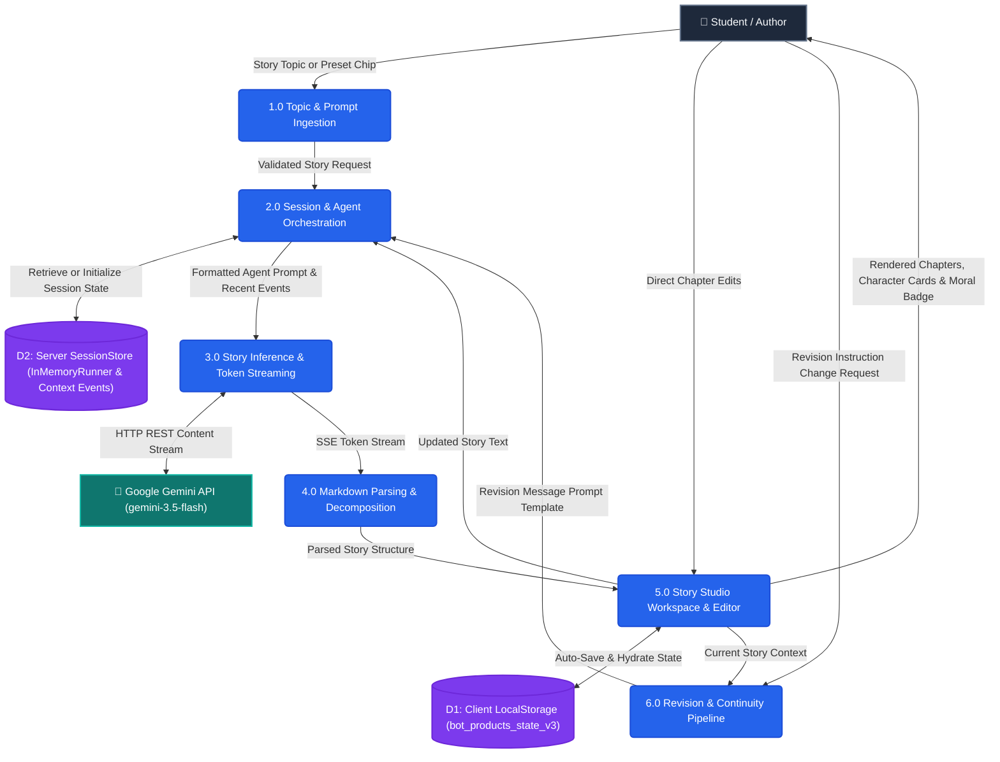
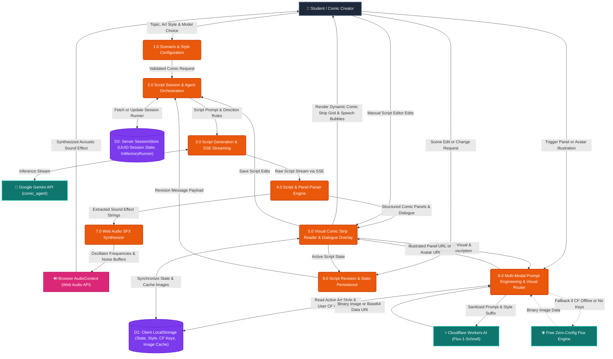

# Data Flow Diagrams (DFD) — AI Creative Studio

This document contains comprehensive Data Flow Diagrams (DFDs) modeled in **Mermaid** for each project in the **Black Orange Talent AI Creative Studio**:

1. [Project 1: AI Story Generator](#project-1-ai-story-generator)
   - Level 0: Context Diagram
   - Level 1: Detailed Data Flow Diagram
   - Data Flow Dictionary
2. [Project 2: AI Comic Book Generator](#project-2-ai-comic-book-generator)
   - Level 0: Context Diagram
   - Level 1: Detailed Data Flow Diagram
   - Multi-Modal Image Pipeline & SFX Flow
   - Data Flow Dictionary
3. [Component & Data Store Mapping](#component--data-store-mapping)

---

## Standard DFD Notation Used

```
[External Entity]     --> Rectangle (External source or sink of data)
(Process)             --> Rounded Rectangle (Transforms incoming data into outgoing data)
[("Data Store")]      --> Database / Open Store (Stores data at rest)
-->|Data Flow|        --> Directed Arrow with Data Flow Label
```

---

## Project 1: AI Story Generator

The **AI Story Generator** transforms creative topics into long-form, rich narrative stories organized into chapter scenes, detailed character traits/arcs, sensory descriptions, and positive moral lessons.

### Level 0: Context Diagram (AI Story Generator)

```mermaid
flowchart TD
    %% Styling
    classDef entity fill:#1e293b,stroke:#64748b,stroke-width:2px,color:#f8fafc;
    classDef process fill:#f97316,stroke:#ea580c,stroke-width:2px,color:#ffffff;
    classDef external fill:#0f766e,stroke:#14b8a6,stroke-width:2px,color:#ffffff;

    User["👤 Student / Author<br>(External Entity)"]:::entity
    System("0.0 AI Story Generator System"):::process
    Gemini["🧠 Google Gemini 3.5 Flash<br>(Google ADK Agent)"]:::external

    %% Inflows & Outflows
    User -->|1. Story Topic / Preset Idea Chips| System
    User -->|2. Revision Request / Direct Text Edits| System
    System -->|3. System & Context Prompt| Gemini
    Gemini -->|4. Raw Story Markdown Stream (SSE)| System
    System -->|5. Structured Story Chapters & Moral| User
    System -->|6. Real-Time Token Generation Stream| User
```

---

### Level 1: Detailed Data Flow Diagram (AI Story Generator)



---

### Data Flow Dictionary (AI Story Generator)

| Data Flow | Source | Destination | Description |
| :--- | :--- | :--- | :--- |
| **Story Topic / Preset Chip** | Student | `1.0 Topic Ingestion` | Topic string entered by student or selected from creative suggestion chips (e.g. *Whispering Clock*). |
| **Validated Request** | `1.0 Topic Ingestion` | `2.0 Session Orchestration` | Normalized payload containing `topic`, `product_type="story"`, and optional `session_id`. |
| **Agent Prompt + Context** | `2.0 Session Orchestration` | `3.0 Story Inference` | Structured instructions for `story_agent` instructing 5-6 narrative chapters, characters, and moral. |
| **Token Stream (SSE)** | `3.0 Story Inference` | `4.0 Markdown Parsing` | Real-time chunks streamed over Server-Sent Events (`data: {"token": "..."}`). |
| **Parsed Story Object** | `4.0 Markdown Parsing` | `5.0 Story Workspace` | JSON structure split into `# Title`, `# Characters`, `# Comic Scenes` (Chapters), and `# Moral`. |
| **Revision Instruction** | Student | `6.0 Revision Pipeline` | Targeted change request (e.g., *"Make the dragon friendly instead of scary"*). |
| **REVISION_MESSAGE** | `6.0 Revision Pipeline` | `2.0 Session Orchestration` | Compound prompt wrapping current story + change request to ensure narrative continuity. |

---

## Project 2: AI Comic Book Generator

The **AI Comic Book Generator** creates full comic book scripts broken down into individual panels with camera angles, narrator captions, character dialogue lines, and sound effects (**BAM!**, **WHOOSH!**, **ZAP!**), paired with a multi-modal image generation engine (Cloudflare Workers AI & Free Flux) and a Web Audio SFX synthesizer.

### Level 0: Context Diagram (AI Comic Book Generator)

```mermaid
flowchart TD
    %% Styling
    classDef entity fill:#1e293b,stroke:#64748b,stroke-width:2px,color:#f8fafc;
    classDef process fill:#f97316,stroke:#ea580c,stroke-width:2px,color:#ffffff;
    classDef external fill:#0f766e,stroke:#14b8a6,stroke-width:2px,color:#ffffff;
    classDef audio fill:#be185d,stroke:#9d174d,stroke-width:2px,color:#ffffff;

    Creator["👤 Student / Comic Creator<br>(External Entity)"]:::entity
    System("0.0 AI Comic Book Studio System"):::process
    Gemini["🧠 Google Gemini 3.5 Flash<br>(comic_agent)"]:::external
    Cloudflare["⚡ Cloudflare Workers AI<br>(Flux.1 Schnell / SDXL)"]:::external
    FreeFlux["🌐 Free Fallback Flux Engine<br>(Zero-Config Backup)"]:::external
    WebAudio["🔊 Web Audio API<br>(Synthesizer Engine)"]:::audio

    %% Main Inflows & Outflows
    Creator -->|1. Comic Scenario, Art Style, Model & CF Keys| System
    Creator -->|2. Panel Illustration Trigger & Script Edits| System
    System -->|3. Comic Scriptwriting Prompt with Camera & SFX Specs| Gemini
    Gemini -->|4. Script Token Stream (Panels, SFX, Dialogue)| System
    System -->|5. Cleaned Visual Prompt + Style Preset Modifiers| Cloudflare
    System -.->|5b. Fallback Request (Zero API Key)| FreeFlux
    Cloudflare -->|6. Synthesized Panel Artwork / Avatar (Base64)| System
    FreeFlux -.->|6b. Fallback Generated Image| System
    System -->|7. SFX Trigger (BAM!, WHOOSH!, ZAP!, THOOM!)| WebAudio
    WebAudio -->|8. Real-Time Audio Frequency Waveforms| Creator
    System -->|9. Interactive Comic Strip, Speech Bubbles & Panels| Creator
```

---

### Level 1: Detailed Data Flow Diagram (AI Comic Book Generator)



---

### Data Flow Dictionary (AI Comic Book Generator)

| Data Flow | Source | Destination | Description |
| :--- | :--- | :--- | :--- |
| **Topic, Art Style & Model** | Creator | `1.0 Scenario Ingestion` | Comic plot idea, chosen art style (Modern Comic, Manga, Pop-Art, Pixar 3D, Noir, Watercolor) and diffusion model. |
| **Script Prompt** | `2.0 Session Orchestration` | `3.0 Script Generation` | Enforces 5-6 numbered panels, `[Camera: ...]`, `Caption: "..."`, `Character: "..."`, and bold onomatopoeia (`**BAM!**`, `**ZAP!**`). |
| **Raw Script Stream** | `3.0 Script Generation` | `4.0 Script & Panel Parser` | Server-Sent Events stream containing the live generated markdown script. |
| **Structured Panels** | `4.0 Script & Panel Parser` | `5.0 Visual Comic Reader` | Extracted JSON containing panel numbers, camera setup, narration captions, multi-turn dialogues, and SFX tags. |
| **Sound Effect Trigger** | `4.0 Script & Panel Parser` / UI | `7.0 SFX Synthesizer` | Trigger string (e.g. `WHOOSH`, `ZAP`, `BOOM`) passed to client-side Web Audio oscillator/filter. |
| **Sanitized Scene Prompt** | `5.0 Visual Comic Reader` | `6.0 Visual Router` | Strips sound effect shouts and markdown formatting, extracts visual action and camera directions. |
| **Enriched Prompt** | `6.0 Visual Router` | Cloudflare / Fallback API | Concatenates cleaned scene prompt with chosen style preset suffixes and negative prompts. |
| **Rendered Artwork** | Cloudflare / Fallback API | `5.0 Visual Comic Reader` | Base64 data URI or image URL bound dynamically to the specific comic panel or character portrait. |
| **Revision Directive** | Creator | `8.0 Script Revision` | Panel-specific tweak request formatted into `REVISION_MESSAGE` preserving the remaining issue script. |

---

## Component & Data Store Mapping

| Entity / Store | Scope | Purpose |
| :--- | :--- | :--- |
| **`D1: Client LocalStorage`** | Browser Client | Stores `bot_products_state_v3` (both story and comic state), `bot_comic_style`, `bot_comic_model`, `bot_cf_account_id`, `bot_cf_api_token`, and panel image cache. |
| **`D2: Server SessionStore`** | FastAPI Backend | In-memory multi-tenant store keyed by UUID containing `ProductState` with active `InMemoryRunner`, agent instances, and event history. |
| **`story_agent`** | Backend ADK | Specialized Gemini Flash agent primed for literary narrative storytelling, chapter structure, and character backstory. |
| **`comic_agent`** | Backend ADK | Specialized Gemini Flash agent primed for panel pacing, cinematic visual camera setup, speech bubble dialogue, and SFX. |
| **`image_generator.py`** | Backend Router | Multi-modal visual engine integrating Cloudflare Workers AI (Flux Schnell, SDXL Base/Lightning) and Zero-Config Fallback. |
| **`soundEffects.js` / Web Audio** | Frontend Client | 100% free and local procedural audio synthesis engine producing authentic comic sound effects using Web Audio API nodes. |
