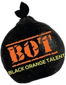
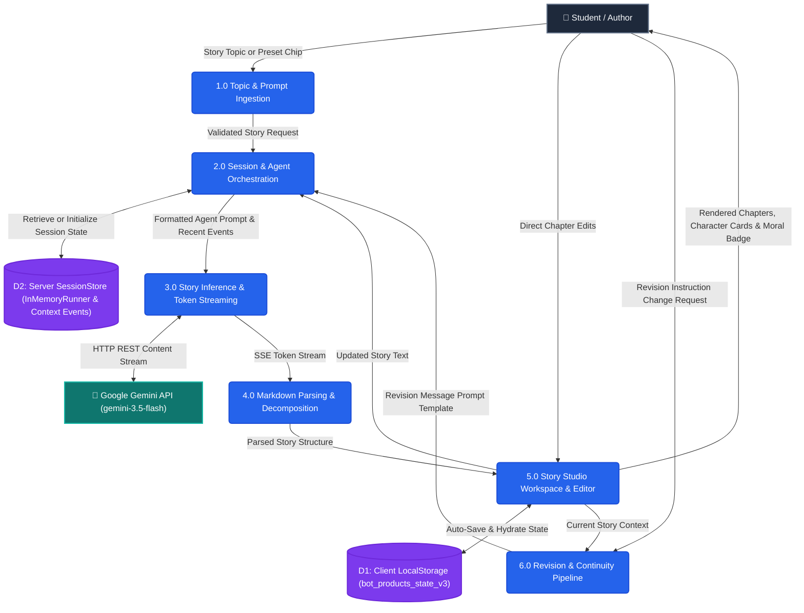
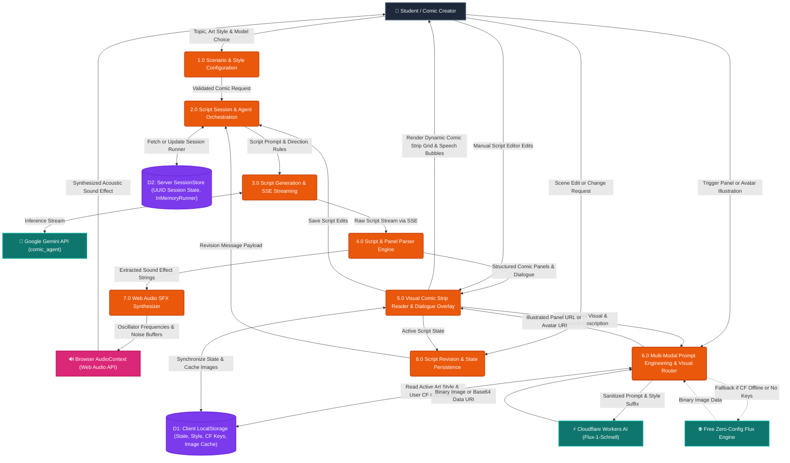

# AI Comic & Story Studio | Black Orange Talent

<p align="center">
  
</p>

<p align="center">
  <strong>Production-Ready AI Creative Studio with Multi-Modal Image Generation</strong><br>
  Powered by <strong>Google Gemini</strong>, <strong>Google ADK</strong>, <strong>Cloudflare Workers AI (Free Tier)</strong>, <strong>FastAPI</strong>, and <strong>React + Tailwind CSS</strong>.
</p>

<p align="center">
  
  
  
  
  
</p>

---

## Overview

The **Black Orange Talent AI Creative Studio** is a dual-format creative suite designed for students and creators:

1. **AI Comic Book Generator**:
   - Generates action-packed comic scripts with visual camera setups, dialogue bubbles, and sound effect badges (**BAM!**, **WHOOSH!**, **ZAP!**, **POW!**).
   - **Visual Comic Strip Reader**: Illustrates panels dynamically using **Cloudflare Workers AI Free Models** (FLUX.1 [schnell], SDXL Base 1.0, SDXL Lightning) and zero-config free fallbacks.
   - **6 Curated Comic Art Styles**: Modern Comic (Marvel/DC), Manga / Shonen, Vintage Pop-Art (Roy Lichtenstein), 3D Animated (Pixar Style), Graphic Novel Noir, and Storybook Watercolor.
   - **Character Cast Portraits**: One-click character avatar generation matching the chosen comic art style.

2. **AI Story Generator**:
   - Rich narrative chapter storytelling with thoughtful prose, character arcs, sensory details, and positive moral lessons.

---

## Architecture

```
┌────────────────────────────────────────────────────────────────────────┐
│                   React + Vite + Tailwind CSS SPA                      │
│  - Multi-Product Switcher (Story vs. Comic Studio)                     │
│  - Collapsible Sidebar with Full-Width Workspace Expansion             │
│  - Consolidated Right-Side Generator Capsule (Styles, Models, Revise)  │
│  - Visual Comic Strip Reader & Speech Bubble Dialogue Overlays         │
│  - Real-Time Token Streaming (SSE) & Interactive Script Editor         │
└───────────────────────────────────┬────────────────────────────────────┘
                                    │ HTTP & SSE Streaming
                                    ▼
┌────────────────────────────────────────────────────────────────────────┐
│                         FastAPI Backend (8080)                         │
│  - Multi-Tenant Session Isolation (UUID-keyed state store)             │
│  - Real-Time SSE Endpoints (/api/generate-stream, /api/revise-stream)  │
│  - Google ADK InMemoryRunner with Gemini Flash Agents                  │
│  - Image Generation Router (/api/generate-image)                       │
└───────────────────┬────────────────────────────────┬───────────────────┘
                    │                                │
                    ▼                                ▼
┌──────────────────────────────────────┐ ┌───────────────────────────────┐
│ Cloudflare Workers AI (Free Tier)    │ │ Zero-Config Free Flux Engine  │
│ • @cf/black-forest-labs/flux-schnell │ │ • Instant serverless pipeline │
│ • @cf/stabilityai/sdxl-base-1.0      │ │ • Zero API key needed backup  │
│ • 10,000 Neurons/Day allocation      │ │ • 100% reliable fallback      │
└──────────────────────────────────────┘ └───────────────────────────────┘
```

---

## Data Flow Diagrams (DFD)

The system isolates state and manages real-time streaming and multi-modal generation for each creative product. For detailed level-0 context models and data flow dictionaries, see [DFD_DIAGRAMS.md](DFD_DIAGRAMS.md).

### 1. AI Story Generator (Data Flow Diagram)



---

### 2. AI Comic Book Generator (Data Flow Diagram)



---

## Project Structure

```
BOT_RAG/
├── DFD_DIAGRAMS.md          # Comprehensive Data Flow Diagrams & Data Dictionaries
├── agent.py                 # Google ADK agent prompts (comic_agent & story_agent)
├── image_generator.py       # Cloudflare Workers AI & Free Flux image pipeline
├── server.py                # FastAPI backend (SSE streaming, state, image API)
├── run_web.py               # Backend entry launcher script with auto-reload
├── requirements.txt         # Production Python dependencies
├── .env.example             # Template for API keys and Cloudflare settings
├── .gitignore               # Clean git ignore patterns
│
├── frontend/                # React + Tailwind CSS SPA
│   ├── src/
│   │   ├── components/      # VisualComicStrip, GeneratorCapsule, StoryMiddlePane, etc.
│   │   ├── context/         # ThemeContext (Dark / Light mode)
│   │   ├── services/        # API service and SSE streaming consumer
│   │   └── utils/           # Markdown & scene parsers
│   ├── public/              # Static assets (logo.png, robot_hero.jpg, favicon)
│   └── package.json         # Vite + React dependencies & scripts
│
└── static/                  # Vanilla HTML/CSS/JS Studio & Landing Page
    ├── index.html           # Brand Landing Page
    ├── products.html        # Unified Creative Studio
    ├── projects.js          # Client-side state, streaming & illustration logic
    └── projects.css         # Modern 3-column responsive layout
```

---

## Quick Start

### Prerequisites
- **Python 3.10+**
- **Node.js 18+** & `npm`
- **Google Gemini API Key** (Free tier from [Google AI Studio](https://aistudio.google.com/))
- *(Optional)* **Cloudflare Account ID & Workers AI Token** (10,000 Neurons/Day free tier)

---

### 1. Environment Setup

Create a `.env` file in the project root (or copy from `.env.example`):

```bash
cp .env.example .env
```

Fill in your credentials:

```env
# Required for Story and Comic Generation
GOOGLE_API_KEY=your_google_gemini_api_key_here

# Optional: Cloudflare Workers AI (10,000 Neurons/Day Free Tier)
CLOUDFLARE_API_KEY=your_cloudflare_workers_ai_token_here
CLOUDFLARE_ACCOUNT_ID=your_cloudflare_account_id_here
```

> [!NOTE]
> If Cloudflare credentials are not provided, the studio automatically runs on the **Zero-Config Free Flux Engine**, meaning image generation works out-of-the-box with **zero setup**.

---

### 2. Backend Setup (FastAPI)

```bash
# Create and activate virtual environment
python -m venv venv
# On Windows:
venv\Scripts\activate
# On macOS/Linux:
source venv/bin/activate

# Install dependencies
pip install -r requirements.txt

# Start backend server
python run_web.py
```

The server starts at `http://127.0.0.1:8080`.

---

### 3. Frontend Setup (React + Tailwind)

In a separate terminal:

```bash
cd frontend
npm install
npm run dev
```

Open `http://localhost:5173` to explore the React studio with hot-reloading. API requests are automatically proxied to the FastAPI backend on port 8080.

#### Production Build (Served directly by FastAPI)

```bash
cd frontend
npm run build
```

Once built, visit `http://127.0.0.1:8080/` or `http://127.0.0.1:8080/app` to experience the production build served directly from FastAPI.

---

## API Reference

| Method | Endpoint | Description |
| :--- | :--- | :--- |
| `POST` | `/api/generate-stream` | Server-Sent Events (SSE) real-time streaming story/comic generation |
| `POST` | `/api/generate` | Standard JSON story/comic script generation |
| `POST` | `/api/revise-stream` | Real-time SSE streaming story revision |
| `POST` | `/api/revise` | Standard JSON story revision |
| `POST` | `/api/generate-image` | Generates comic panel illustrations via Cloudflare Workers AI or fallback engine |
| `GET` | `/api/image-styles` | Lists available comic art styles and AI models |
| `GET` | `/api/cloudflare/status`| Checks Cloudflare credentials and free tier status |
| `POST` | `/api/cloudflare/config`| Updates Cloudflare Account ID & API Token dynamically |
| `POST` | `/api/save-edits` | Persists user manual edits to the active session |
| `POST` | `/api/reset` | Resets a specific session state |
| `GET` | `/api/state` | Retrieves the active session state |

---

## License

MIT © Black Orange Talent Pvt. Ltd.
